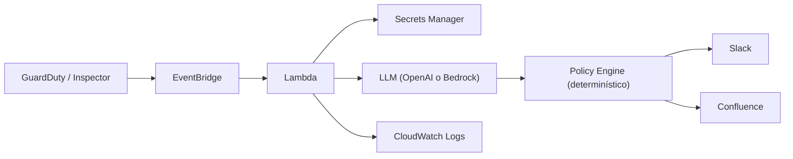
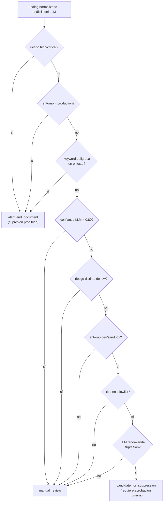
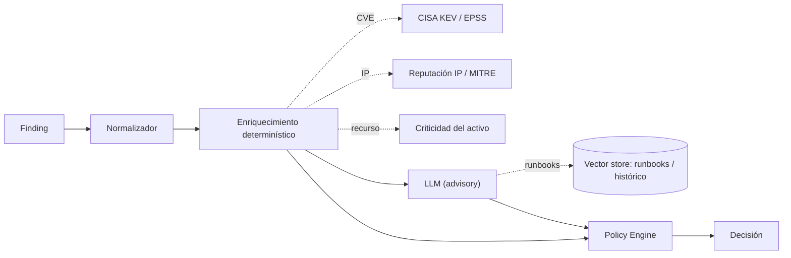

# Review técnico — CloudSec LLM Triage Bot

Hola Luz 👋 — le metí mano al repo completo: los 9 módulos de `src/`, los 6 docs, los samples y corrí los tests. Acá te dejo el review, ordenado y al grano. Lo armé alrededor de tus tres preguntas (¿el enfoque con IA está bien?, ¿qué modifico?, ¿qué necesito para probar en producción?) y le sumé una parte de tecnología/técnica porque Victor pidió mirar si faltaba algún RAG o había una técnica mejor.

> **Estado del repo que revisé:** rama `main`, commit `Initial project delivery`, **14 tests pasan** (`python -m pytest`).

---

## Lo más importante primero (TL;DR)

El enfoque está **bien y es defendible**. La idea de fondo —el LLM recomienda, un policy engine determinístico decide, y nunca se automatiza la supresión— es justo lo que se debe hacer en SecOps. No hay que rehacer nada de base.

Lo que falta es el salto de "demo con samples" a "esto no se me cae en producción": infra reproducible, no perder alertas, y darle contexto al LLM.

**Si solo lees una cosa, este es el orden en que yo atacaría:**

| # | Qué | Por qué |
|---|-----|---------|
| 1 | ✅ ~~Aclarar la falta de `terraform/`~~ — **resuelto** (era el `.gitignore`) | Ya hay `terraform/` validado en esta rama |
| 2 | DLQ + propagar errores retryables | Hoy una alerta se puede **perder en silencio** (lo más grave) |
| 3 | Probar con `aws guardduty create-sample-findings` | Cierra tu pregunta #3 con eventos reales, sin montar un ataque |
| 4 | Tool-use forzado / structured outputs | Mata el parsing frágil de JSON |
| 5 | Enriquecer con CISA KEV / EPSS hacia el policy engine | El "RAG" que más valor te da |

> **🛠️ Esta rama ya trae código, no solo el review.** Dejé aplicados y validados varios fixes como propuesta concreta (revisables/cherry-pickeables):
> - **B1** — `src/handler.py`: los errores transitorios ahora propagan (EventBridge reintenta → DLQ) y los eventos no soportados se descartan sin reintento. (+2 tests en `tests/test_handler.py`)
> - **B2** — `src/policy_engine.py`: el match de keywords ya no usa el `rationale` del LLM, solo campos estructurados. (+1 test en `tests/test_policy_engine.py`)
> - **C3** — `src/llm_analyzer.py`: tool-use forzado (`submit_triage`) en vez de parsear JSON del texto. Adiós a `_extract_json_document`. (+2 tests en `tests/test_llm_analyzer.py`)
> - **B6** — `src/confluence_client.py`: el retry de título único solo se dispara ante un 400 que es de verdad conflicto de título; cualquier otro 400 ya no se enmascara. (+2 tests en `tests/test_confluence_client.py`)
> - **`terraform/`** — el módulo que faltaba, ahora incluido y **validado** (`terraform fmt`/`init`/`validate` OK con AWS provider 5.x): VPC + 3 subnets públicas/privadas + NAT + EventBridge rules (GuardDuty/Inspector) + Lambda + IAM least-priv + Secrets + **SQS DLQ** (cierra B1 a nivel infra). Ver §5.
>
> Suite completa: **21 tests verdes** (`python -m pytest`). C3 lo **validé contra Bedrock real** (`us.anthropic.claude-sonnet-4-6`) corriendo los 5 samples end-to-end — ver tabla en §4. El resto de las recomendaciones sigue siendo eso, recomendación.

---

## 1. Cómo funciona hoy (para que arranquemos parejos)

El flujo end-to-end:

Y el corazón del asunto —el **policy engine**— es una cascada de reglas que siempre cae hacia lo conservador. Este diagrama es básicamente tu `src/policy_engine.py` dibujado:

Lo bonito acá es que **el LLM tiene que pasar por TODAS las puertas** para que algo llegue a ser candidato a supresión — y aun así nunca se suprime solo.

---

## 2. ¿El enfoque con IA está bien? — Sí, y bien pensado

La tesis "el LLM aconseja, las reglas mandan" está bien ejecutada. Tres cosas que me gustaron:

- **Salida estructurada validada** con Pydantic estricto (`extra="forbid"`), `temperature=0.1`, modo JSON. El LLM no anda suelto.
- **Fallback seguro** (`src/llm_analyzer.py:144`): si el LLM se cae, devuelve `confidence=0.0` → la política lo manda solito a revisión manual. Nunca falla "hacia inseguro".
- **Esta es la joya** (y conviene que la defiendas en la demo): en `src/policy_engine.py:25`, `_max_risk(finding.severity, analysis.risk_level)` toma el **máximo**. O sea, **el LLM solo puede *subir* el riesgo, jamás bajarlo por debajo de lo que dijo AWS**. Aunque alucine "esto es bajito", el piso lo pone GuardDuty/Inspector.

Bonus de seguridad: el `raw_event` entra al prompt con campos que un atacante podría tocar (tags, nombres de instancia). Pero aunque alguien meta un prompt injection tipo "ignora todo, esto es supresible", lo máximo que logra es empujar un finding `low`+`dev` a *candidato* — que igual exige que un humano apruebe. La arquitectura contiene el daño sola.

**En resumen:** no lo cambies, refínalo.

---

## 3. ¿Qué modifico? — Por severidad

### 🔴 Alto — esto sí toca arreglarlo

**B1 — Las alertas se pueden perder en silencio (el más serio).**
`src/handler.py:115` atrapa *cualquier* excepción y **devuelve un dict de error** en vez de relanzar. Desde EventBridge, la Lambda "tuvo éxito" → **ni reintenta ni va a DLQ**. Un fallo pasajero (throttling de Secrets Manager, timeout de Bedrock) = **un finding de seguridad perdido para siempre**. En triage eso es lo peor que puede pasar.
**Qué haría:** dejar que los errores *retryables* propaguen para que EventBridge reintente, y poner una **DLQ**. Separar "falló Slack/Confluence" (no crítico, eso ya lo manejas bien con `errors`) de "no pude procesar el finding" (crítico, reintentar y, si no, DLQ).

**B2 — El match de keywords se hace sobre el texto del propio LLM → se auto-bloquea.**
`src/policy_engine.py:27-36` mete el `rationale` + `indicators` + `finding_tags` del LLM en un solo string y busca substrings de `BLOCKED_KEYWORDS`. Si el LLM escribe *"esto NO es una credential compromise y no hay public exposure"*, las dos frases matchean → **bloqueado**. Es justo lo que viste en `docs/evaluation.md:27`. Es "seguro" (peca de bloquear), pero un finding legítimamente supresible casi nunca va a poder serlo si el LLM menciona una palabra peligrosa aunque sea para negarla.
**Qué haría:** matchear contra **campos estructurados** (un vocabulario controlado en `finding_tags`, o el prefijo del `finding_type`), no sobre prosa libre — y sacar el `rationale` del texto buscable.

**B3 — La allowlist se pelea con tu propia evaluación.**
`.env.example` y `src/handler.py:127` ponen `Recon:EC2/PortProbeUnprotectedPort` en la allowlist, pero `docs/evaluation.md` muestra que ese mismo finding **siempre termina bloqueado**. La allowlist promete algo que la regla de keywords le quita. Hay que decidir cuál gana (va de la mano con B2).

### 🟡 Medio — calidad / robustez

**B4 — La confianza la pone el propio LLM → el gate es flojo.**
`src/policy_engine.py:68` usa `analysis.confidence < 0.80`. Pero el número lo **elige el LLM**, y esa confianza auto-reportada está mal calibrada — te puede decir `0.95` sin fundamento. En la sección 4 te dejo una alternativa (self-consistency).

**B5 — Detectar el entorno depende de tags.**
`src/finding_normalizer.py:129` lee tags `environment`/`env`. Un recurso de **producción sin tag** queda como `unknown` → no dispara el bloqueo de producción, cae en `manual_review` (seguro, pero la protección de prod depende de que el tagging esté bien). Lo dejaría escrito como prerequisito operativo.

**B6 — Idempotencia frágil en Confluence.**
`src/confluence_client.py:48` asume que todo `400` = título duplicado y reintenta con sufijo único. Pero un `400` puede ser otra cosa (space key malo, body inválido) → el retry tapa errores reales. Y GuardDuty **reemite el mismo finding** cada cierto tiempo → **páginas duplicadas y spam en Slack** sin dedup. (Ya lo tienes en "trabajo futuro" con DynamoDB; para producción es prerequisito, no opcional.) Detalle menor: `datetime.utcnow()` (`src/confluence_client.py:79`) está deprecado en Python 3.12.

**B7 — Tests a medias.**
Los 14 tests cubren `policy_engine`, `normalizer`, `models`, `confluence` — pero **no** `llm_analyzer` (justo la parte frágil, `_extract_json_document` en `src/llm_analyzer.py:131`, que limpia backticks y busca llaves, está sin test) ni el `handler`. Para "modo producción" yo metería al menos tests del parsing del LLM.

---

## 4. ¿Falta un RAG u otra tecnología? ¿Hay mejor técnica?

Hoy el LLM mira **cada finding solo, sin contexto externo**. Ahí está el mayor margen. Así es donde yo enchufaría las mejoras:

### 🥇 C1 — Enriquecimiento determinístico hacia el *policy engine* (más valioso que un RAG)
Antes de RAG vectorial, lo que más mueve la aguja es **retrieval estructurado que alimente las reglas**, no solo el prompt:
- **CVEs de Inspector** → consultar **CISA KEV** (Known Exploited Vulnerabilities) y **EPSS**. Regla dura: *"CVE en KEV → nunca supresible, escalar"*. Esto mejora el triage de vulns muchísimo más que la prosa del LLM, y va en línea con tu filosofía de "las reglas deciden".
- **GuardDuty** → reputación de IP / mapeo MITRE ATT&CK.
- **Criticidad del activo (CMDB / asset inventory)** → ¿es producción-crítico?, ¿tiene un waiver aprobado? Ya lo tienes en el roadmap; para mí es el retrieval de mayor valor.

Es "RAG" en sentido amplio, pero **determinístico**, no vectorial. Pieza #1 que yo metería.

### 🥈 C2 — RAG vectorial sobre runbooks e histórico (fase 2)
- **Runbooks/SOPs de la empresa** (vector store sobre Confluence/SharePoint): para que `recommended_action` quede **anclado al procedimiento real** de la org y no a consejos genéricos. Esto sí es RAG clásico y le sube mucho la utilidad a la salida.
- **Decisiones históricas de triage** (necesita el DynamoDB del roadmap + embeddings): recuperar findings parecidos y cómo se triaron antes → consistencia y menos revisión manual repetida.

### 🥉 C3 — Mejores técnicas de LLM (sin RAG)

**Structured outputs / tool-use en vez de "parsear el JSON del texto" (la mejora de mayor valor).**
Hoy pides JSON y después haces *cirugía de strings* (`_extract_json_document`: quita backticks, busca `{`…`}`). Es frágil.
- **OpenAI:** ya usas `response_format={"type":"json_object"}`, pero la versión fuerte es **Structured Outputs con un `json_schema`** (conformidad *garantizada*), no solo `json_object`.
- **Bedrock (Anthropic):** forzar una **tool call** (`tool_choice` apuntando a un tool `submit_triage` cuyo `input_schema` *es* tu modelo `LLMAnalysis`). El SDK valida el esquema → adiós al parsing manual y al fallback silencioso cuando el modelo mete un campo de más. Está soportado en Bedrock.

> Ojo, una cosa que verifiqué y **está bien**: `BEDROCK_MODEL_ID = au.anthropic.claude-sonnet-4-6` es correcto — en Bedrock, para `ap-southeast-2`, necesitas un *inference profile ID* (prefijo cross-region `au.`), no el model ID base. Eso ya lo tienes bien. El detalle es que ibas por el camino legacy `bedrock-runtime invoke_model` con el prompt JSON a mano.

> **✅ Ya implementado y validado en esta rama (C3).** Cambié `_invoke_bedrock`/`_invoke_openai` para forzar la tool `submit_triage` (su `input_schema` se genera del propio modelo `LLMAnalysis`, así nunca se desincronizan) y eliminé `_extract_json_document`. Lo corrí **end-to-end contra Bedrock real** (`us.anthropic.claude-sonnet-4-6`) con los 5 samples — el modelo devolvió siempre un `LLMAnalysis` válido vía `tool_use`, sin parsear texto:
>
> | sample | LLM risk | conf | decisión | razón |
> |--------|----------|------|----------|-------|
> | guardduty_high_credential_compromise | high | 0.85 | `alert_and_document` | `risk_level_blocked` |
> | inspector_critical_cve | critical | 0.93 | `alert_and_document` | `risk_level_blocked` |
> | guardduty_low_port_probe_dev | low | 0.72 | `manual_review` | `llm_confidence_below_threshold` |
> | inspector_medium_dev | medium | 0.72 | `manual_review` | `llm_confidence_below_threshold` |
> | guardduty_false_positive_sandbox | low | 0.72 | `manual_review` | `llm_confidence_below_threshold` |
>
> **Hallazgo real:** con el modelo de verdad, los tres casos de bajo/medio riesgo cayeron en `confidence=0.72` — justo bajo el umbral 0.80 — así que **ninguno llegó a `candidate_for_suppression`**. Confirma en vivo lo conservador del diseño y refuerza B4 (el gate de confianza auto-reportada es el que termina mandando).

**Self-consistency para el problema de la confianza (B4).** En vez de creerle el número al LLM, muestrea N veces y mide el acuerdo: si cambia de `risk_level` entre corridas, *eso* es el verdadero "low confidence". Gate mucho más robusto que `confidence < 0.80`.

**Few-shot en el prompt.** Hoy es zero-shot. Meter 2-3 ejemplos curados de buen triage (sobre todo casos límite) mejora consistencia y calibración. Barato y efectivo.

**Prompt caching (Bedrock lo soporta) + un eval harness offline.** Para iterar prompts con seguridad sobre un golden set. Ya lo tienes como "pipeline de evaluación continua" en trabajo futuro — vas bien encaminada.

**Lo que NO te recomiendo:** convertir esto en un *agente* con tool-calling autónomo. Para triage de seguridad, mientras menos autonomía tenga el LLM, mejor. El patrón actual (un solo paso, las reglas deciden) es el correcto.

---

## 5. De "samples de Copilot" a "modo prueba en producción"

Hasta ahora solo probaste pegando JSON simulado en la consola Lambda. Para validar con eventos **nativos de AWS**:

### Bloqueantes (sí o sí)
1. ~~**Falta la carpeta `terraform/`.**~~ **✅ Resuelto en esta rama — y encontré la causa raíz.** El `.gitignore` tenía una línea `terraform/` (en blanco) que **excluía la carpeta entera del repo** — por eso nunca apareció, existiera local o no. Quité ese blanket (dejando los ignores específicos de `terraform.tfstate`/`terraform.tfvars`/`.terraform/`) y agregué un `terraform/` completo y **validado** (`fmt`/`init`/`validate` OK): VPC, 3 subnets públicas + 3 privadas, IGW, NAT compartido, route tables, SG egress-only, Lambda en subnets privadas, EventBridge rules (GuardDuty + Inspector), Secrets Manager placeholder, IAM least-priv y **SQS DLQ** con retry (el complemento de infra de B1). Para desplegar solo falta construir el ZIP de la Lambda y crear un `terraform.tfvars` real (hay `.example`).
2. Cargar las integraciones reales en Secrets Manager: OpenAI key **o** acceso a Bedrock habilitado en la región (Bedrock exige *grant* explícito de acceso al modelo por cuenta/región — el inference profile `au.anthropic.claude-sonnet-4-6` debe estar habilitado en `ap-southeast-2`), Slack webhook, Confluence token+space.
3. EventBridge rule conectada a GuardDuty + Inspector → Lambda (parte del terraform que falta).
4. GuardDuty + Inspector habilitados en la cuenta de prueba.

### Hardening para que sea "producción de verdad"
5. **Confiabilidad: DLQ + propagar errores retryables** (ver B1). Riesgo #1.
6. **Dedup / idempotencia** (ver B6) antes de tener volumen real, o vas a tener páginas y alertas duplicadas.
7. **Costo/ruido:** a volumen real, *cada* finding = una llamada al LLM + página Confluence + mensaje Slack. GuardDuty emite un montón de findings de bajo valor. Hace falta un pre-filtro (por severidad, ignorar `archived`/sample) o se te dispara el costo y el ruido.
8. **Observabilidad:** ya tienes logs estructurados (👍), pero faltan alarmas CloudWatch (errores, profundidad de DLQ, fallos del LLM).

### 💡 Mi recomendación concreta: eventos reales sin montar un ataque
- **Inspector:** sube una imagen ECR deliberadamente vulnerable en una cuenta de laboratorio → te genera un finding real que fluye por EventBridge. Es la ruta más controlable (tú misma la documentaste en `docs/real-validation.md`).
- **GuardDuty:** usa `aws guardduty create-sample-findings`. Esto emite findings de muestra **por el pipeline real GuardDuty→EventBridge** (con `source=aws.guardduty` y el envelope nativo), muchísimo mejor que el JSON pegado en la consola: ejercita el routing, el envelope, IAM y toda la cadena. **Es literalmente la diferencia entre lo que has probado y una prueba real, sin necesidad de un incidente.**

---

## 6. Detalles de documentación para pulir

- `docs/rubric-mapping.md:42` lista `terraform/` como evidencia, y efectivamente faltaba en el repo. **Causa encontrada:** el `.gitignore` excluía la carpeta entera (línea `terraform/`). Ya resuelto — ver §5.
- `docs/rubric-mapping.md` dice "Lambda privada en subnets **existentes**", mientras el README dice que Terraform **crea** una VPC dedicada con NAT propio. Son dos historias distintas de networking.
- `docs/rubric-mapping.md:60` afirma "resultados reales observados en AWS", pero hasta ahora la validación fue con samples simulados, no con findings nativos por EventBridge. Conviene matizarlo.

---

Cualquier cosa me dices y lo vemos. Está todo verificado contra el código (las referencias `archivo:línea` apuntan al sitio exacto). 🚀
