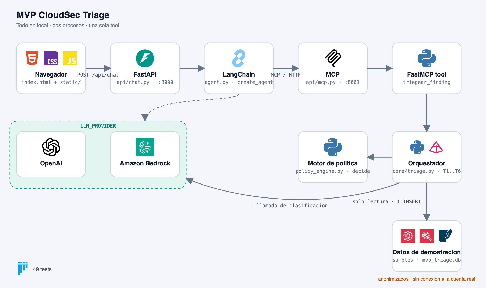
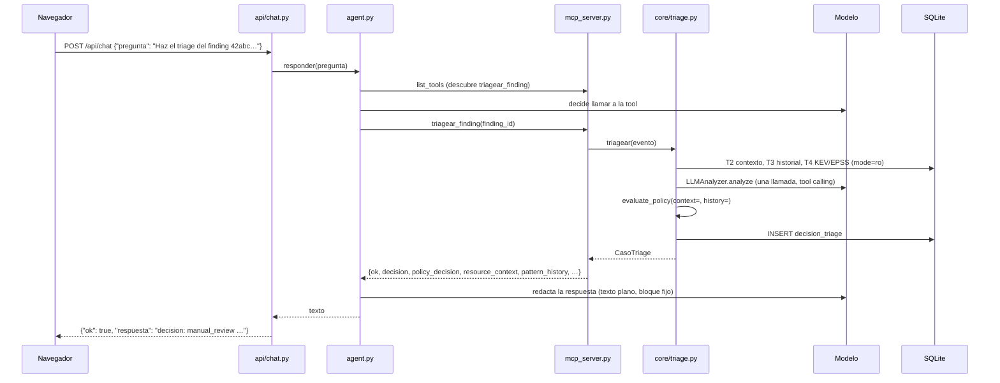

# MVP CloudSec Triage

Triage asistido por LLM de findings de **Amazon GuardDuty** y **Amazon Inspector**,
en local, con FastAPI, FastMCP, LangChain `create_agent` y un frontend estatico sin
frameworks. Entrega academica. Reutiliza la logica de dominio del sistema serverless
que vive en la raiz de este repositorio y anade dos capacidades que ese sistema
promete y todavia no implementa: **contexto de recurso** e **historial de patron**.

> El modelo interviene una sola vez y no decide. La decision la toma un motor de
> politica determinista, queda registrada con su razon, y ninguna supresion se
> ejecuta: solo se propone.

---

## Indice

1. [Que problema resuelve y para quien](#1-que-problema-resuelve-y-para-quien)
2. [Guia rapida para el evaluador](#2-guia-rapida-para-el-evaluador)
3. [Arquitectura](#3-arquitectura)
4. [Mapa del codigo](#4-mapa-del-codigo)
5. [Instalacion](#5-instalacion)
6. [Variables requeridas](#6-variables-requeridas)
7. [Levantarlo](#7-levantarlo)
8. [Interfaz](#8-interfaz)
9. [Pruebas](#9-pruebas)
10. [Criterios de aceptacion y verificacion](#10-criterios-de-aceptacion-y-verificacion)
11. [Ejemplos de uso](#11-ejemplos-de-uso)
12. [Evidencias](#12-evidencias)
13. [Cambiar a Bedrock](#13-cambiar-a-bedrock)
14. [Registro de decisiones](#14-registro-de-decisiones)
15. [Seguridad y privacidad](#15-seguridad-y-privacidad)
16. [Limitaciones conocidas](#16-limitaciones-conocidas)
17. [Pendientes y trabajo futuro](#17-pendientes-y-trabajo-futuro)
18. [Trazabilidad](#18-trazabilidad)

---

## 1. Que problema resuelve y para quien

Un equipo de seguridad en la nube recibe mas findings de los que puede revisar uno a
uno. La mayoria son ruido conocido; unos pocos son graves. Este MVP toma un finding,
lo normaliza, consulta que se sabe del recurso afectado y de su historial, pide una
clasificacion al modelo y deja que un **motor de politica determinista** tome la
decision final: escalar, revisar a mano o proponer para supresion. El modelo es
advisorio; nunca decide.

Las dos capacidades nuevas respecto al sistema serverless:

- **T2, contexto de recurso.** Si el recurso no esta inventariado, no se puede valorar
  su explotabilidad y el finding va a revision manual.
- **T3, historial de patron.** Un escaneo recurrente que cambia de puerto o de origen
  deja de ser ruido conocido y va a revision manual, con los cambios detectados.

Publico: un evaluador que abre la pagina, hace clic en un finding y espera ver una
decision con su razon. Usuario final: el lider DevSecOps, unica persona que puede
aprobar una supresion.

**Por que datos sinteticos.** El sistema serverless de la raiz si esta conectado a
GuardDuty e Inspector a traves de EventBridge, dentro de la cuenta de AWS. El MVP es
una entrega academica que corre en local y se comparte fuera de la organizacion, asi
que **por privacidad no se conecta a la cuenta real**: un finding real describe la
superficie de ataque de la cuenta (identificadores de cuenta y de recurso, claves de
acceso, direcciones IP de origen, CVE presentes en produccion). En su lugar usa
plantillas de prueba: los cinco findings del repositorio, ya anonimizados y con la
forma real del sobre de EventBridge, mas dos creados para la demo, y un inventario,
un historial y un catalogo KEV/EPSS sinteticos y coherentes con ellos. La logica que
se ejercita es la misma; solo cambia la fuente de los eventos. Detalle en la
[seccion 14](#14-registro-de-decisiones).

---

## 2. Guia rapida para el evaluador

Quince minutos, de cero a ver las siete decisiones en pantalla.

**Requisitos previos.** Python 3.12, y una de estas dos cosas: una clave de OpenAI, o
credenciales de AWS con acceso a Bedrock (ver [seccion 13](#13-cambiar-a-bedrock)).

**1. Instalar**, desde la carpeta `mvp/`:

```bash
cd mvp
python3.12 -m venv .venv
source .venv/bin/activate
pip install -r requirements.txt
cp .env.example .env
```

**2. Configurar.** Edita `.env` y pon tu clave en `OPENAI_API_KEY`. El resto de
valores por defecto sirven.

**3. Levantar**, en dos terminales, desde `mvp/` y con el entorno activado:

```bash
uvicorn api.mcp:app --reload --port 8001
```

```bash
uvicorn api.chat:app --reload --port 8000
```

**4. Abrir** <http://127.0.0.1:8000>. La barra superior muestra el proveedor de
modelo configurado; si dice "no configurado", revisa `.env` y reinicia los dos
procesos.

**5. Probar.** A la izquierda estan los siete findings de demostracion, plantillas
anonimizadas: por privacidad el MVP no consulta la cuenta real de AWS. Haz clic en
uno: la consulta se prepara en el cuadro de texto, lista para enviar. O pulsa
**Ejecutar** en la tarjeta para lanzar el triage directamente. Cada respuesta llega
como una tarjeta con la decision coloreada, el nivel de riesgo, los reason codes y la
explicacion. Esto es lo que debe salir:

| Finding (tarjeta) | Decision esperada | Reason code | Que demuestra |
|---|---|---|---|
| UnauthorizedAccess:IAMUser/AnomalousBehavior (`12abc…`) | `alert_and_document` | `risk_level_blocked` | Riesgo alto: nunca se suprime |
| Recon:EC2/PortProbeUnprotectedPort, honeypot sandbox (`32abc…`) | `manual_review` | `resource_context_not_found` | **T2**: recurso fuera del inventario |
| Recon:EC2/PortProbeUnprotectedPort, dev (`22abc…`) | `manual_review` o `candidate_for_suppression` | `only_low_risk_can_be_suppressed` o `suppression_allowed` | Sondeo recurrente igual al historico; depende del riesgo que devuelva el modelo |
| Recon:EC2/PortProbeUnprotectedPort, variacion (`42abc…`) | `manual_review` | `pattern_variation_detected` | **T3**: puerto 3389 y origen nuevos frente al historico (22, 203.0.113.45) |
| Critical package vulnerability CVE-2026-12345 (Inspector) | `alert_and_document` | `cve_in_cisa_kev_blocked` | Puerta CISA KEV, con catalogo local |
| Medium package vulnerability (Inspector) | `manual_review` | `only_low_risk_can_be_suppressed` | Severidad media en dev: no es suprimible |
| AWS Health Event (fuera de alcance) | `out_of_scope` | `event_out_of_scope` | No es un finding: cero llamadas al modelo, ninguna fila registrada |

**6. Reproducir los casos negativos.**

- *Tool invalida*: escribe en el cuadro `Haz el triage del finding no-existe` y envia.
  El agente reporta el error de la tool sin inventar un resultado.
- *MCP caido*: para el proceso del puerto 8001 (Ctrl+C), pulsa Ejecutar en cualquier
  tarjeta y veras la tarjeta de error con el mensaje del backend. Vuelve a levantarlo
  y repite: funciona sin reiniciar nada mas.
- *Fuera de alcance*: la tarjeta "AWS Health Event". Comprueba en la base que no deja
  fila (ver [seccion 11](#11-ejemplos-de-uso)).

**7. Verificar automaticamente.** Con los dos servidores levantados:

```bash
python verificar.py
```

Ejecuta los casos de aceptacion a, b, c, d y f contra el servidor MCP, hace un
`POST /api/chat` real y termina con una tabla PASS/FAIL y el SELECT sobre
`decision_triage`. Anade `--todos-los-samples` para pasar los siete findings,
`--caso e` con el puerto 8001 apagado para el caso de MCP caido, y
`--guardar docs/evidencias/salidas` para conservar cada respuesta JSON.

**8. Ejecutar los tests**: `pytest tests/ -q`. Deben salir 49 en verde.

---

## 3. Arquitectura



*Version detallada, con el papel de cada modulo y las reglas del motor:*
[`docs/arquitectura.png`](docs/arquitectura.png). La version de iconos tambien esta
en SVG: [`docs/arquitectura-iconos.svg`](docs/arquitectura-iconos.svg).

```mermaid
flowchart TD
    U[Lider DevSecOps<br/>navegador] -->|GET /, /static, /api/findings| CHAT
    U -->|POST /api/chat {pregunta}| CHAT[api/chat.py<br/>FastAPI :8000]
    CHAT -->|responder(pregunta)| AG[agent.py<br/>LangChain create_agent]
    AG -->|MultiServerMCPClient<br/>MCP sobre HTTP| MCP[api/mcp.py<br/>FastMCP :8001]
    MCP --> TOOL[mcp_server.py<br/>UNA tool: triagear_finding]
    TOOL --> TRI[core/triage.py<br/>orquestador, orden fijo]
    TRI --> T1[T1 normalize_finding_event<br/>copiado]
    TRI --> T2[T2 consultar_contexto_recurso<br/>SQLite solo lectura]
    TRI --> T3[T3 consultar_historial_patron<br/>SQLite solo lectura]
    TRI --> T4[T4 enrichment_local<br/>KEV/EPSS en SQLite]
    TRI --> T5A[LLMAnalyzer.analyze<br/>UNICA clasificacion]
    TRI --> T5[T5 evaluate_policy<br/>copiado + 2 reglas]
    TRI --> T6[T6 registrar_decision<br/>unico INSERT]
    FAB[llm_factory.py<br/>LLM_PROVIDER decide] -.-> AG
    FAB -.-> T5A
    DB[(data/mvp_triage.db)] --- T2
    DB --- T3
    DB --- T4
    DB --- T6
```

**Flujo de una consulta:**



**Dos capas llaman al modelo, una sola fabrica.** El analizador de triage (dentro de
la tool) y el agente conversacional obtienen su cliente de `llm_factory.py`, asi que
**siempre** usan el mismo proveedor. Si el analizador fuera por Bedrock y el agente
por OpenAI, el finding completo saldria igual de AWS hacia un tercero y el argumento
de privacidad se caeria. Una sola variable, `LLM_PROVIDER`, cambia las dos capas.

**Dos procesos separados a proposito.** Apagar el 8001 es como se demuestra el caso
"MCP no disponible" sin tocar el backend.

---

## 4. Mapa del codigo

| Ruta | Que es | Origen |
|---|---|---|
| `api/chat.py` | FastAPI :8000. Sirve `index.html`, `/static`, `GET /api/findings` y `POST /api/chat`. Traduce errores a JSON. Sin logica de agente ni SQL | nuevo |
| `api/mcp.py` | Sirve el servidor MCP por HTTP: `mcp.http_app(path="/", stateless_http=True)` | nuevo |
| `agent.py` | `create_agent` sobre el cliente de la fabrica; descubre la tool con `MultiServerMCPClient`. Expone `async responder(pregunta) -> str` | nuevo |
| `prompts.py` | System prompt del agente: prohibido clasificar; texto plano; bloque fijo `decision / final_risk_level / reason_codes / recommended_action` | nuevo |
| `llm_factory.py` | `ChatOpenAI` o `ChatBedrockConverse` para el agente y los parametros de `LLMAnalyzer`, segun `LLM_PROVIDER` | nuevo |
| `mcp_server.py` | La unica tool MCP, `triagear_finding(finding_id)`. Errores siempre como `{"ok": false, "error"}` | nuevo |
| `config.py` | Lectura de `.env` con python-dotenv. Unico sitio con `os.getenv` | nuevo |
| `core/triage.py` | Orquestador: T1 → T2 → T3 → T4 → modelo → T5 → T6. Fuera de alcance sin modelo ni escritura | nuevo |
| `core/context.py` | T2 `consultar_contexto_recurso` y T3 `consultar_historial_patron`, SQLite `mode=ro`, consultas parametrizadas | nuevo |
| `core/db.py` | Crea y siembra `data/mvp_triage.db` (cuatro tablas). `registrar_decision` es el unico INSERT | nuevo |
| `core/enrichment_local.py` | Misma firma que `enrichment.enrich_finding`, lee `kev_epss` en vez de salir a internet | nuevo |
| `core/local_secrets.py` | `IntegrationSecretBundle` desde el entorno; vacio con Bedrock | nuevo |
| `core/samples.py` | Indice de `data/samples/` por identificador; lo que la pagina lista | nuevo |
| `core/models.py` | Contrato Pydantic. Gana `ResourceContext`, `PatternHistory`, `FueraDeAlcance`, `CasoTriage` | copiado + anadido |
| `core/policy_engine.py` | Motor determinista. `evaluate_policy()` gana `context=` e `history=` y dos reglas | copiado + modificado |
| `core/finding_normalizer.py` | T1, normalizacion del sobre de EventBridge | copiado |
| `core/enrichment.py` | T4 original con salida a red. Intacto, no se usa | copiado |
| `core/llm_analyzer.py` | Llamada al modelo con tool calling y `_safe_default` | copiado |
| `core/logger.py` | Logging estructurado | copiado |
| `data/samples/*.json` | Siete eventos: cinco del repo (uno con `portProbeDetails` anadidos), la variacion de patron y un AWS Health Event | copiado + anadido |
| `data/mvp_triage.db` | SQLite sintetica; se crea sola. Ignorada por git | generado |
| `index.html`, `static/app.js`, `static/style.css` | Frontend: HTML, CSS y JS planos | nuevo |
| `tests/` | 23 tests copiados sin modificar + 26 nuevos | copiado + nuevo |
| `verificar.py` | Verificacion de extremo a extremo reproducible (casos a-f, POST, SELECT) | nuevo |
| `docs/` | Diagrama de arquitectura y carpeta de evidencias | nuevo |
| `src -> core`, `samples -> data/samples` | Symlinks para que los tests copiados resuelvan sus rutas sin tocarlos | nuevo |

---

## 5. Instalacion

Desde la carpeta `mvp/`:

```bash
cd mvp
python3.12 -m venv .venv
source .venv/bin/activate
pip install -r requirements.txt
cp .env.example .env
# edita .env
```

Tambien vale crear el entorno en la raiz del repositorio (`pip install -r
mvp/requirements.txt`); los comandos de arranque y de tests se ejecutan igual desde
`mvp/`.

Requiere Python 3.12. `fastmcp` va fijado a `>=2.14,<3` porque `fastmcp` 4.x exige
`mcp>=2.0` y `langchain-mcp-adapters` 0.3.x exige `mcp<2.0`: son incompatibles, y
2.14 es la ultima serie que funciona con ambos. `requests` se anade porque
`core/enrichment.py`, copiado del sistema serverless, lo importa. Son las dos unicas
diferencias respecto a la lista de dependencias del enunciado.

Versiones con las que se hizo la verificacion: fastapi 0.141.1, uvicorn 0.52.4,
fastmcp 2.14.7, langchain 1.4.0, langchain-core 1.6.3, langchain-openai 1.1.9,
langchain-aws 1.7.6, langchain-mcp-adapters 0.3.2, mcp 1.30.0, openai 1.109.1,
boto3 1.43.93, pydantic 2.13.5, pytest 8.4.2.

---

## 6. Variables requeridas

Todas en `mvp/.env` (ver `mvp/.env.example`).

| Variable | Para que |
|---|---|
| `LLM_PROVIDER` | `openai` o `bedrock`. Una sola variable cambia el proveedor de **ambas** capas |
| `OPENAI_API_KEY`, `OPENAI_MODEL`, `OPENAI_BASE_URL` | Solo con `openai`. Por defecto `gpt-4.1-mini` |
| `AWS_REGION`, `AWS_PROFILE`, `BEDROCK_MODEL_ID` | Solo con `bedrock` |
| `LLM_SELF_CONSISTENCY_SAMPLES` | Muestras del analizador (1 = una llamada por triage) |
| `SUPPRESSION_ALLOWLIST` | Tipos de finding que pueden ser candidatos a supresion |
| `MCP_URL` | Donde el agente descubre la tool. Por defecto `http://127.0.0.1:8001/` |
| `LOG_LEVEL` | Nivel de log |
| `VENTANA_HISTORIAL_DIAS` | Ventana de T3 en dias. Por defecto 30 |
| `MINIMO_OCURRENCIAS_PATRON` | Ocurrencias previas para considerar que hay patron. Por defecto 3 |
| `LANGSMITH_*` | Trazas opcionales de LangChain; desactivadas por defecto |

Ninguna clave va en codigo, README, logs ni commits. `mvp/.env` esta en `.gitignore`.

`mvp/.env` se lee una vez, al arrancar cada proceso. Tras cambiar `LLM_PROVIDER` o
cualquier otra variable hay que reiniciar **los dos** servidores; `--reload` vigila
el codigo, no el `.env`. Una variable exportada en el shell gana sobre el fichero.

---

## 7. Levantarlo

Dos procesos, desde `mvp/`:

```bash
uvicorn api.mcp:app --reload --port 8001
```

```bash
uvicorn api.chat:app --reload --port 8000
```

Abre <http://127.0.0.1:8000>. La base SQLite `data/mvp_triage.db` se crea sola la
primera vez, con datos sinteticos derivados de los samples. Para regenerarla, borra
el fichero y vuelve a arrancar, o ejecuta `python -m core.db`.

Si un puerto esta ocupado, `lsof -nP -iTCP:8000 -iTCP:8001 -sTCP:LISTEN` dice quien lo
tiene; un servidor viejo responde con el proveedor viejo (la tool lo delata en
`proveedor_modelo`).

---

## 8. Interfaz

Una sola pagina, sin frameworks: `index.html`, `static/style.css` y `static/app.js`.
En este orden:

1. **Titulo y una linea** que dice que hace el sistema y para quien.
2. **Aviso de datos sinteticos**, siempre visible bajo la barra.
3. **Los findings disponibles**, como tarjetas agrupadas por fuente (GuardDuty,
   Inspector, fuera de alcance) con severidad, recurso y entorno, sacados del mismo
   normalizador que usa el triage. Un clic en la tarjeta **rellena el cuadro de texto
   con una consulta lista para enviar**; el boton **Ejecutar** la lanza directamente.
   Debajo, una leyenda plegable explica las cuatro decisiones posibles.
4. **Historial de mensajes** en el DOM. Cada respuesta se pinta como una tarjeta con la
   decision coloreada segun su gravedad, el nivel de riesgo, los reason codes como
   chips, la accion recomendada destacada y la explicacion del agente.
5. **Cuadro de texto y boton Enviar.** Enter envia; Shift+Enter hace salto de linea.

Tres estados visuales distinguibles: **cargando** (tarjeta punteada con cronometro
real), **respuesta del agente** (tarjeta coloreada) y **error** (tarjeta roja con el
mensaje que devolvio el backend). El estado de error es un criterio de aceptacion.

La barra superior muestra el proveedor de modelo configurado (lo devuelve
`/api/findings`). La pagina respeta el tema claro u oscuro del sistema y se adapta a
pantallas estrechas. Todo el texto que llega del backend se inserta con
`textContent`; el frontend no genera HTML a partir de la respuesta del modelo, hace
`fetch` por ruta relativa y no conoce al modelo.

`GET /api/findings` devuelve, por sample, `finding_id`, `fichero`, `titulo`,
`fuente_aws`, `en_alcance`, `severidad`, `entorno`, `recurso` y `tipo`, mas
`proveedor` y `advertencia`.

---

## 9. Pruebas

```bash
cd mvp
pytest tests/ -q
```

| Fichero | Tests | Que cubre |
|---|---|---|
| `test_models.py`, `test_finding_normalizer.py`, `test_policy_engine.py`, `test_enrichment.py`, `test_llm_analyzer.py` | 23 | Copias **sin modificar** de `tests/` del sistema serverless. Si uno falla, se rompio algo copiado |
| `test_policy_context.py` | 12 | Las dos reglas nuevas, su orden respecto a las existentes, el umbral 0.80 intacto y la equivalencia con `context=None, history=None` |
| `test_triage_alcance.py` | 8 | Evento fuera de alcance: cero llamadas al modelo y ninguna fila; la tool con `finding_id` vacio o inexistente; `_metadata_segura` |
| `test_api_chat.py` | 6 | Capa HTTP con `TestClient`: contrato de `/api/findings`, 400 con pregunta vacia, 503 con MCP caido, 503 con proveedor invalido, 500 sin filtrar detalle |

Total: **49 tests**. Ninguno llama al modelo ni necesita red: los del analizador usan
mocks y los del orquestador prohiben construir el analizador. Los symlinks
`mvp/src -> core` y `mvp/samples -> data/samples` existen solo para que los tests
copiados resuelvan sus rutas sin tocarlos.

---

## 10. Criterios de aceptacion y verificacion

Todo lo de esta seccion se ejecuto de verdad; nada se da por hecho. Los JSON
completos de la ultima ejecucion estan en `docs/evidencias/salidas/`.

**Estatica.** `ast.parse` sobre todos los `.py` sin errores; los 20 modulos importan;
`pytest tests/ -q`: 49 en verde, incluidos los copiados sin modificar.

**Arranque.** `uvicorn api.mcp:app --port 8001` expone una unica tool,
`triagear_finding`. `uvicorn api.chat:app --port 8000` sirve `/`, `/static/app.js`,
`/static/style.css` y `/api/findings` con 200.

**Los seis criterios**, ejecutados con `verificar.py` contra los servidores reales:

| # | Caso | Como se ejercito | Resultado | Veredicto |
|---|------|------------------|-----------|-----------|
| a | Compromiso de credenciales | tool via cliente MCP y `POST /api/chat` real | `alert_and_document`, `high`, `risk_level_blocked`, `candidate_for_suppression = False` | PASS |
| b | Recurso no inventariado | tool via cliente MCP | `manual_review`, `resource_context_not_found` | PASS |
| c | Fuera de alcance | tool via cliente MCP | `out_of_scope`, `llamadas_al_modelo = 0`, `registro_id = None`, cero filas nuevas | PASS |
| d | Tool invalida | tool con `""` y con un id inexistente | `{"ok": false, "error": …}` en ambos, sin filas nuevas | PASS |
| e | MCP caido | `POST /api/chat` con el puerto 8001 cerrado | 503, `{"ok": false, "error": "El servidor MCP no responde…"}`, sin traza ni secretos | PASS |
| f | Variacion de patron | tool via MCP y `POST /api/chat` real | `manual_review`, `pattern_variation_detected`, variaciones de puerto (3389 frente a 22) y de origen | PASS |

`decision_triage` acumula una fila por cada triage en alcance y ninguna para el
evento de AWS Health. `verificar.py` imprime el SELECT agrupado por `finding_id` con
las filas nuevas de cada ejecucion.

**Los siete samples**, ademas de los criterios, con un clic cada uno desde la pagina
y despues con `verificar.py --todos-los-samples`:

| Sample | Decision | Reason code |
|---|---|---|
| Sondeo en honeypot sandbox | `manual_review` | `resource_context_not_found` |
| Compromiso de credenciales | `alert_and_document` | `risk_level_blocked` |
| Sondeo recurrente sin variacion | `manual_review` | `only_low_risk_can_be_suppressed` |
| Sondeo con variacion de patron | `manual_review` | `pattern_variation_detected` |
| CVE critico en KEV (Inspector) | `alert_and_document` | `cve_in_cisa_kev_blocked` |
| CVE medio en dev (Inspector) | `manual_review` | `only_low_risk_can_be_suppressed` |
| AWS Health Event | `out_of_scope` | `event_out_of_scope` |

**Dos proveedores.** La verificacion completa se hizo dos veces: con
`LLM_PROVIDER=bedrock` (`au.anthropic.claude-sonnet-4-6`, `ap-southeast-2`) y con
`LLM_PROVIDER=openai` (`gpt-4.1-mini`). Las decisiones y los reason codes fueron
identicos: las puertas duras del motor no dependen de la confianza del modelo.

| | Bedrock, Claude Sonnet 4.6 | OpenAI, gpt-4.1-mini |
|---|---|---|
| Triage directo via MCP | unos 15 s | unos 3 s |
| Consulta completa via agente | unos 25 s | unos 6 s |
| Confianza del modelo en el caso b | 0.72 | 0.95 |
| Confianza del modelo en el caso f | 0.82 | 0.80 |

**Interfaz.** Verificada en el navegador: lista de tarjetas con severidad, recurso y
entorno; clic que rellena el cuadro de texto; Ejecutar directo; estado de carga con
cronometro; tarjeta de resultado coloreada para `alert_and_document`,
`manual_review` y `out_of_scope`; tarjeta de error con el MCP caido; tema claro y
oscuro; vista movil de 375 px.

---

## 11. Ejemplos de uso

**Consulta real al backend**, tal como la hace la pagina:

```bash
curl -s -X POST http://127.0.0.1:8000/api/chat \
  -H 'Content-Type: application/json' \
  -d '{"pregunta":"Haz el triage del finding 12abc34d567e8fa901bc234d567ef890"}'
```

Respuesta (real, con OpenAI; el agente empieza siempre con el bloque de cuatro lineas):

```json
{
  "ok": true,
  "respuesta": "decision: alert_and_document\nfinal_risk_level: high\nreason_codes: risk_level_blocked\nrecommended_action: Escalate immediately. Suppression is forbidden for high or critical risk findings.\n\nEl finding 12abc34d567e8fa901bc234d567ef890 es un evento de GuardDuty que indica un posible compromiso de credenciales para un usuario IAM … Estos datos son sintéticos de demostración."
}
```

**La tool directamente**, saltandose el agente (util para ver el contrato completo):

```python
import asyncio
from fastmcp import Client

async def main():
    async with Client("http://127.0.0.1:8001/") as cliente:
        resultado = await cliente.call_tool(
            "triagear_finding", {"finding_id": "42abc34d567e8fa901bc234d567ef893"}
        )
        datos = resultado.data
        print(datos["decision"], datos["policy_decision"]["reason_codes"])
        print(datos["pattern_history"]["variaciones"])

asyncio.run(main())
```

```
manual_review ['pattern_variation_detected']
['puerto 3389 nunca visto antes (historico: 22)', 'origen 198.51.100.77 nunca visto antes (historico: 203.0.113.45)']
```

El diccionario que devuelve la tool trae `ok`, `decision`, `finding`, `enrichment`,
`llm_analysis`, `policy_decision`, `resource_context`, `pattern_history`,
`llamadas_al_modelo`, `registro_id`, `fuente`, `proveedor_modelo` y `advertencia`.
Hay un ejemplo completo por sample en `docs/evidencias/salidas/`.

**Error controlado**, con el puerto 8001 apagado:

```bash
curl -s -w '\nHTTP %{http_code}\n' -X POST http://127.0.0.1:8000/api/chat \
  -H 'Content-Type: application/json' -d '{"pregunta":"Haz el triage del finding 12abc34d567e8fa901bc234d567ef890"}'
```

```
{"ok":false,"error":"El servidor MCP no responde. Levantalo con `uvicorn api.mcp:app --port 8001` desde la carpeta mvp/ y vuelve a intentarlo. No se ejecuto ningun triage."}
HTTP 503
```

**Lo que quedo registrado:**

```bash
sqlite3 data/mvp_triage.db "select id, finding_id, decision, reason_codes, registrado_en from decision_triage order by id desc limit 5"
```

```bash
sqlite3 data/mvp_triage.db "select count(*) from decision_triage where finding_id = 'evt-unsupported-001'"
```

El segundo debe dar siempre `0`: el evento fuera de alcance no se registra.

**Las consultas de T2 y T3 a mano**, para ver los datos sinteticos:

```bash
sqlite3 -header data/mvp_triage.db "select * from inventario_recurso"
```

```bash
sqlite3 -header data/mvp_triage.db "select finding_type, resource_id, puerto, origen, fecha from finding_historico order by fecha"
```

---

## 12. Evidencias

`docs/` reune el material de apoyo para la evaluacion:

| Ruta | Contenido |
|---|---|
| `docs/arquitectura-iconos.png`, `.svg` | Diagrama de arquitectura con los iconos de cada tecnologia y el texto minimo |
| `docs/arquitectura.png` | Diagrama de arquitectura detallado, con el papel de cada modulo |
| `docs/evidencias/salidas/` | Respuestas JSON reales de la tool y del backend, una por caso y por sample, generadas con `python verificar.py --todos-los-samples --guardar docs/evidencias/salidas` |
| `docs/evidencias/capturas/` | 14 capturas reales de la interfaz, una por estado o funcionalidad, tomadas con Chromium automatizado (indice en `docs/evidencias/README.md`) |
| `docs/evidencias/videos/` | Grabaciones de la demo |

`docs/evidencias/README.md` explica que va en cada carpeta y con que nombre, para que
las capturas y los videos se puedan anadir sin tocar este README.

---

## 13. Cambiar a Bedrock

Configuracion recomendada para produccion: la inferencia ocurre dentro de AWS y
ningun dato de finding sale hacia un tercero.

Requisitos previos:

1. Credenciales AWS locales (perfil en `~/.aws/credentials` o variables de entorno).
2. Permiso `bedrock:InvokeModel` sobre el modelo o el inference profile.
3. Acceso al modelo **habilitado en la consola de Bedrock para esa region**.
4. `BEDROCK_MODEL_ID` como **ID o ARN de inference profile**, no como model ID base.
   Por ejemplo `au.anthropic.claude-sonnet-4-6` o `apac.anthropic.claude-sonnet-4-20250514-v1:0`.

En `mvp/.env`:

```
LLM_PROVIDER=bedrock
AWS_REGION=ap-southeast-2
AWS_PROFILE=tu-perfil
BEDROCK_MODEL_ID=au.anthropic.claude-sonnet-4-6
```

Reinicia los dos servidores. No hay que tocar codigo: `llm_factory.py` devuelve
`ChatBedrockConverse` para el agente y los parametros de Bedrock para `LLMAnalyzer`,
y `local_secrets.py` deja el bundle de secretos vacio porque la autenticacion es por
IAM.

---

## 14. Registro de decisiones

**Ruta del PoC: A, llamada simple.** El MVP la envuelve como tool FastMCP en lugar
de llamar al modelo directo desde el backend, para conservar el mismo contrato que
el resto de la clase y cubrir el checklist de la guia.

**Consecuencia declarada.** El MVP introduce una segunda invocacion al modelo, la
del agente conversacional, que no existia en el PoC. El agente tiene prohibido
clasificar, asignar riesgo o emitir juicios (ver `prompts.py`); solo llama a la tool
y reporta `decision`, `final_risk_level` y `reason_codes`. El motor determinista
sigue siendo el unico que decide.

**Proveedor.** Soporta OpenAI y Bedrock con una variable. Se valido con OpenAI y,
ademas, con Bedrock; los seis criterios dan el mismo resultado con ambos. Bedrock es
la configuracion recomendada para produccion, porque la inferencia ocurre dentro de
AWS y ningun dato de finding sale hacia un tercero. Ambas capas que llaman al modelo
usan **siempre** el mismo proveedor, por diseno: salen de la misma fabrica,
`llm_factory.py`.

**Que se reutilizo del sistema serverless.** Copiado a `mvp/core/` desde el commit
`694b2c80f8fad43d4f61ede54fccef6202cb846b`, punta de la rama
`review/cloudsec-triage` (ya fusionada en `main`):
`models.py`, `finding_normalizer.py`, `policy_engine.py`, `enrichment.py`,
`llm_analyzer.py`, `logger.py`. Los cinco tests correspondientes se copiaron sin
modificar. Es una copia deliberada, no un import a `../src`; la divergencia es
rastreable con `diff` (ver [seccion 18](#18-trazabilidad)).

Modificaciones sobre lo copiado, y solo estas:

- `policy_engine.evaluate_policy()` gana `context` y `history` opcionales al final
  de la firma, y dos reglas nuevas tras `production_environment_blocked` y antes
  de la puerta de confianza. Con `None` el comportamiento es identico.
- `models.py` gana `ResourceContext`, `PatternHistory`, `FueraDeAlcance` y
  `CasoTriage`. Este ultimo envuelve a `TriageResult` porque ese modelo declara
  `extra="forbid"` y no puede transportar el contexto, el historial, las llamadas
  al modelo ni el id de registro. Por eso `triagear()` devuelve `CasoTriage` y no
  `TriageResult` a secas: el `TriageResult` original va dentro, intacto.
- La copia de `data/samples/guardduty_low_port_probe_dev.json` incorpora
  `portProbeDetails` (puerto 22, origen `203.0.113.45`). El original no traia puerto
  ni origen, y sin ellos T3 no tendria nada que contrastar contra el historico. El
  `samples/` de la raiz queda intacto.

**Que se dejo fuera.** Slack, Confluence, deduplicacion en DynamoDB, DLQ, VPC y
Terraform. No se copiaron `handler.py`, `slack_notifier.py`,
`confluence_client.py`, `dedup.py` ni `secrets.py`. El MVP no publica, no
deduplica y no se despliega.

**Que se anadio y por que.** T2 (`consultar_contexto_recurso`) y T3
(`consultar_historial_patron`) en `core/context.py`, sobre SQLite en modo solo
lectura y con consultas parametrizadas. Cubren la deteccion de variaciones del
patron recurrente que la ficha de caso de uso promete y el sistema serverless
todavia no implementa. `variacion_detectada` exige que exista un patron
(`MINIMO_OCURRENCIAS_PATRON`, por defecto 3) antes de marcar variacion: sin
ocurrencias previas no hay nada de lo que variar.

**Datos sinteticos por privacidad, no por limitacion tecnica.** La integracion
directa con GuardDuty e Inspector existe y funciona en el sistema serverless de la
raiz (EventBridge → Lambda), y `finding_normalizer.py`, copiado tal cual, ya fue
validado contra eventos reales de AWS. Para el MVP se tomo la decision deliberada de
**no conectarlo a la cuenta real y mantener ocultos los datos operativos**: los
findings reales contienen identificadores de cuenta, recursos, claves de acceso,
direcciones IP de origen y CVE presentes en produccion, y una demo academica que se
ejecuta en portatiles y se comparte fuera de la organizacion no debe contenerlos ni
consultarlos. En su lugar, el MVP trabaja con plantillas de prueba: los cinco samples
del repositorio, anonimizados y con la forma real del sobre de EventBridge, mas dos
anadidos para la demo; y un inventario, un historial y un catalogo KEV/EPSS
sinteticos y coherentes con esos samples. La logica que se ejercita es la misma que
en produccion; lo unico que cambia es la fuente de los eventos: `core/samples.py`
lee ficheros en vez de recibir eventos de EventBridge, y es el unico punto a
sustituir para conectar una fuente real. Por la misma razon `enrichment_local.py`
no sale a internet: la demo no debe depender de la red ni de servicios externos para
reproducirse, ni enviar a terceros que CVE tiene la organizacion.

**Un septimo sample.** Ademas de la variacion de patron que pide el enunciado, se
anadio `unsupported_health_event.json`, un AWS Health Event con el sobre de
EventBridge, para poder demostrar el caso "fuera de alcance" desde la propia pagina.

**Robustez ante eventos fuera de alcance.** `inspect_event_shape`, copiado del
sistema serverless, asume la forma de GuardDuty o Inspector: con un AWS Health
Event, cuyo `detail.service` es la cadena `"EC2"`, hace `.get("action")` sobre ella
y falla. En vez de tocar el modulo copiado, `core/triage.py` lo envuelve en
`_metadata_segura()`, que degrada a una metadata minima sacada del sobre de
EventBridge. Salio en la verificacion de extremo a extremo del caso c y esta
cubierto por `tests/test_triage_alcance.py`.

**Formato de la respuesta del agente.** La pagina pinta la respuesta con
`textContent`, sin interpretar markdown, asi que el system prompt exige texto plano
y copia literal de identificadores, tipos de finding, decisiones y reason codes.
Ademas obliga a empezar con un bloque fijo de cuatro lineas (`decision`,
`final_risk_level`, `reason_codes`, `recommended_action`) que la pagina reconoce
para pintar la cabecera de la tarjeta de resultado. Si el modelo responde en prosa,
el frontend rastrea los codigos dentro del texto y, si tampoco los encuentra,
muestra el texto tal cual. Es una regla de presentacion, no de fondo: el agente
sigue sin poder clasificar ni opinar.

**Dependencias.** `requirements.txt` sigue la lista del enunciado con dos
diferencias documentadas en la [seccion 5](#5-instalacion): `fastmcp>=2.14,<3` por
la incompatibilidad con `langchain-mcp-adapters`, y `requests` porque lo importa un
modulo copiado. No se fijan versiones mas alla de eso para respetar la lista; las
versiones validadas quedan anotadas.

---

## 15. Seguridad y privacidad

- **El modelo nunca ve SQL.** T2, T3 y T4 son consultas parametrizadas sobre
  conexiones abiertas con `file:...?mode=ro`; un INSERT por esa via falla. El unico
  punto de escritura es `registrar_decision`.
- **El modelo nunca decide.** `evaluate_policy` es determinista y se ejecuta despues
  del analisis; las puertas duras (KEV, riesgo alto, produccion, variacion, recurso no
  inventariado) no dependen de la confianza que reporte el modelo.
- **Una sola tool, sin efectos.** `triagear_finding` lee y devuelve; no suprime, no
  cierra, no toca infraestructura. No hay tool de supresion porque esa accion no debe
  estar al alcance de un modelo.
- **Un solo proveedor a la vez.** Las dos capas que llaman al modelo salen de la misma
  fabrica; con Bedrock ningun dato sale de AWS.
- **Sin credenciales en codigo ni en logs.** `config.resumen_configuracion()` solo
  dice si la clave esta presente. Los errores HTTP nunca incluyen la traza ni el
  detalle interno (`tests/test_api_chat.py` lo comprueba).
- **Frontend sin HTML generado.** Todo lo que llega del backend se inserta con
  `textContent`.
- **Datos sinteticos por privacidad.** El MVP no se conecta a la cuenta real de AWS.
  Los findings son plantillas anonimizadas con la forma real del sobre de
  EventBridge, y el inventario, el historial y el catalogo KEV/EPSS son locales. Nada
  de lo que se ve procede de una cuenta real ni permite inferir su superficie de
  ataque, asi que la demo, las evidencias y este repositorio se pueden compartir.

---

## 16. Limitaciones conocidas

- Datos sinteticos, por decision de privacidad (ver [seccion 14](#14-registro-de-decisiones)).
  Inventario, historial y catalogo KEV/EPSS son locales y estan derivados de los
  samples. Para conectar una fuente real hay que sustituir `core/samples.py` por la
  recepcion de eventos y alimentar las tablas desde un inventario y un historico
  reales; `enrichment_local.py` sustituye la consulta de red del original, que queda
  intacto pero sin usar.
- Sin autenticacion, sin persistencia remota, sin concurrencia. Un unico usuario.
- El agente se reconstruye en cada peticion (descubre la tool por HTTP cada vez).
  Es deliberado para que un MCP que se cae y vuelve no obligue a reiniciar, pero
  anade latencia.
- La decision depende en parte de la salida del modelo (riesgo y confianza). Las
  reglas duras del motor son deterministas; el resto puede variar entre
  ejecuciones. En concreto, `candidate_for_suppression` solo aparece si el modelo
  valora el riesgo del sondeo recurrente como `low`; con `gpt-4.1-mini` lo valoro
  `medium` y el motor lo mando a revision manual.
- `llamadas_al_modelo` es un calculo (`max(1, LLM_SELF_CONSISTENCY_SAMPLES)`), no
  una medida; con mas de una muestra no se ha probado.
- `mvp/src` y `mvp/samples` son symlinks; en sistemas de ficheros sin soporte de
  symlinks los tests copiados no resolveran sus rutas.

---

## 17. Pendientes y trabajo futuro

1. **Un sample que llegue a `candidate_for_suppression` de forma estable**, o subir
   `LLM_SELF_CONSISTENCY_SAMPLES` para que el riesgo que devuelve el modelo sea menos
   volatil. Hoy la leyenda de la pagina describe una decision que el evaluador puede
   no ver.
2. **Medir `llamadas_al_modelo`** en vez de calcularlo.
3. **Videos** en `docs/evidencias/videos/`: la carpeta esta preparada; las capturas
   ya estan.
4. Trabajo futuro fuera del alcance academico: inventario e historico reales (CMDB,
   findings historicos de la cuenta), aprobacion humana de la supresion con registro
   de quien aprobo, y despliegue del MCP junto al sistema serverless.

---

## 18. Trazabilidad

- **Repositorio:** <https://github.com/deorelaLara/cloudsec-llm-triage-bot>.
- **Rama del MVP:** [`mvp-triage-bot`](https://github.com/deorelaLara/cloudsec-llm-triage-bot/tree/mvp-triage-bot),
  creada desde `review/cloudsec-triage`. Todo el MVP vive en `mvp/`; fuera de esa
  carpeta solo cambio `.gitignore`, que ignora `mvp/.env` y `mvp/data/mvp_triage.db`.
  El sistema serverless original sigue intacto en `src/`, `tests/`, `samples/` y
  `terraform/` de esa misma rama.
- **Commit de origen de la copia:** `694b2c80f8fad43d4f61ede54fccef6202cb846b`,
  punta de `review/cloudsec-triage` y base de `mvp-triage-bot`. Como `src/` no ha
  cambiado desde entonces en esta rama, el `diff` de abajo compara directamente
  contra el codigo del que se copio.
- **Divergencia de los modulos copiados**, desde la raiz del repositorio:

```bash
for m in models.py finding_normalizer.py policy_engine.py enrichment.py llm_analyzer.py logger.py; do echo "== $m"; git diff --no-index src/$m mvp/core/$m; done
```

  Solo `models.py` y `policy_engine.py` deben mostrar diferencias, y solo las
  descritas en la [seccion 14](#14-registro-de-decisiones).

- **Tests copiados, sin modificar:**

```bash
for t in test_models.py test_finding_normalizer.py test_policy_engine.py test_enrichment.py test_llm_analyzer.py; do diff -q tests/$t mvp/tests/$t && echo "$t identico"; done
```
